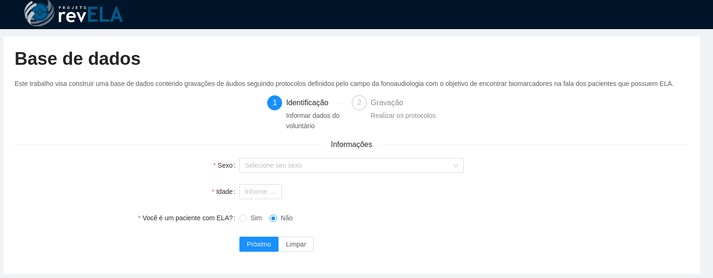
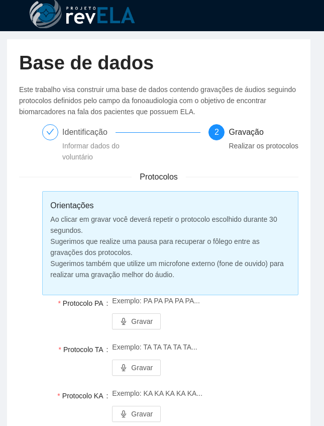

<h1 align="center">
    
</h1>

<h4 align="center"> 
	:heavy_check_mark: Coleta de dados do meu TCC :heavy_check_mark:
</h4>
<p align="center">
  

  
	
  <a href="https://www.linkedin.com/in/johnv-alves/">
    
  </a>

  <a href="https://github.com/JohnVict0r/recorder-speech-therapy/commits/master">
    
  </a>

  
   <a href="https://github.com/JohnVict0r/recorder-speech-therapy/stargazers">
    
  </a>
</p>
<p align="center">
  <a href="#-project">Project</a>&nbsp;&nbsp;&nbsp;|&nbsp;&nbsp;&nbsp;
  <a href="#rocket-Technologies">Technologies</a>&nbsp;&nbsp;&nbsp;|&nbsp;&nbsp;&nbsp;
  <a href="#-how-to-use">How to use</a>&nbsp;&nbsp;&nbsp;|&nbsp;&nbsp;&nbsp;
  <a href="#-how-to-contribute">How to contribute</a>&nbsp;&nbsp;&nbsp;|&nbsp;&nbsp;&nbsp;
  <a href="#memo-license">License</a>
</p>

## 💻 Project

Speech therapy recorder is a project that aims to develop a tool to record the protocols used in patient care.

<h1 align="center">
    
    
</h1>


## :rocket: Technologies

This project was developed with the following technologies:

- [React](https://reactjs.org)


## :information_source: How To Use

To clone and run this application, you'll need [Git](https://git-scm.com), [Node.js][nodejs] + [Yarn][yarn] installed on your computer.

From your command line:

### Install API
```bash
# Clone this repository
$ git clone https://github.com/JohnVict0r/recorder-speech-therapy

# Go into the repository
$ cd recorder-speech-therapy

# Install dependencies
$ yarn install

# Run application
$ yarn start
```

## 🤔 How to contribute

- Make a fork;
- Create a branck with your feature: `git checkout -b my-feature`;
- Commit changes: `git commit -m 'feat: My new feature'`;
- Make a push to your branch: `git push origin my-feature`.

After merging your receipt request to done, you can delete a branch from yours.

## :memo: License

This project is under the MIT license. See the [LICENSE](LICENSE.md) for details.

---

Made with ♥ by John Victor :wave: [Get in touch!](https://www.linkedin.com/in/johnv-alves/)

[yarn]: https://yarnpkg.com/
[vc]: https://code.visualstudio.com/
[vceditconfig]: https://marketplace.visualstudio.com/items?itemName=EditorConfig.EditorConfig
[vceslint]: https://marketplace.visualstudio.com/items?itemName=dbaeumer.vscode-eslint
[prettier]: https://marketplace.visualstudio.com/items?itemName=esbenp.prettier-vscode
